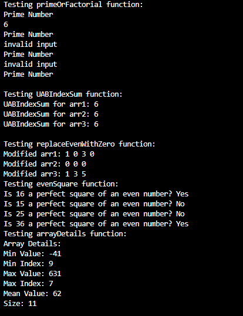

#Compilation Instructions:
If you're a make file ```bash make #compiles all the files
make run #runs all the files

If you are not using a make file:
gcc -o *filename* *filename.c* #this would compile the file and spit out an exe file called *filename*
in this case the filename.c is tgarc19_HW1.c which contains:

primeOrFactorial: This function says the input integer is prime or prints the factorial of the input

UABIndexSum: This function gets the sum of all indexes in the inputted array

replaceEvenWithZero: This function replaces even numbers in an array with zeros

evenSquare: This function finds if the integer is an even square (whether it is a product of an even number multiplied to itself)

arrayDetails: This function takes in an array of integers then prints a resulting array for each of it's details: Min Value, # of Elements, Min Index, Mean, Max Value, Max Index.

#Output Screenshot

    

#References
none